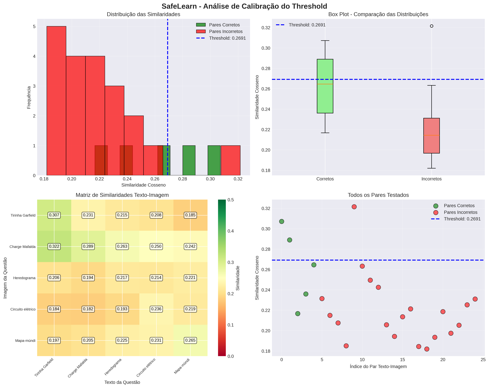

# SafeLearn

## Sistema Multimodal de Verificação de Correspondência Texto-Imagem em Questões

Este trabalho apresenta o SafeLearn, um sistema de verificação de correspondência entre texto e imagem desenvolvido para validar conteúdo em plataformas educacionais. O contexto de aplicação é o Studybuddy, uma plataforma onde professores e alunos criam questões educacionais que frequentemente contêm tanto texto quanto imagens ilustrativas, como gráficos, diagramas, mapas e charges.

O problema que motivou este desenvolvimento é a possibilidade de inconsistências entre o conteúdo textual de uma questão e a imagem anexada a ela. Por exemplo, um professor pode acidentalmente anexar uma imagem de biologia em uma questão de física, ou um usuário pode enviar uma imagem que não tem relação alguma com o texto da questão. Essas inconsistências podem confundir estudantes e prejudicar a qualidade do conteúdo educacional disponível na plataforma.

A solução proposta utiliza o modelo CLIP (Contrastive Language-Image Pre-training), desenvolvido pela OpenAI, que é um modelo multimodal capaz de entender a relação semântica entre texto e imagens. O CLIP foi treinado em milhões de pares de imagem e texto da internet, aprendendo a mapear ambas as modalidades para um espaço vetorial compartilhado onde conteúdos semanticamente relacionados ficam próximos uns dos outros. Esta característica torna o CLIP ideal para a tarefa de verificar se uma imagem corresponde ao conteúdo descrito em um texto.

O sistema desenvolvido processa o texto da questão e a imagem anexada, extrai representações vetoriais de ambos utilizando o CLIP, e calcula a similaridade cosseno entre esses vetores. Com base em um threshold calibrado empiricamente, o sistema determina se a imagem corresponde ao conteúdo textual ou se há uma inconsistência que deve ser reportada ao usuário.

